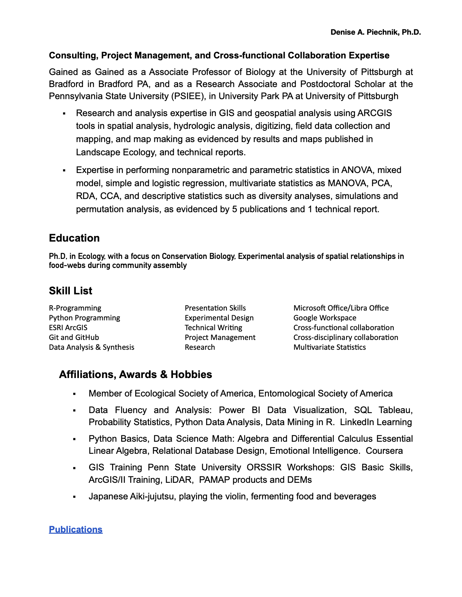

<a href="https://drive.google.com/file/d/1_-pVbkNy-XczLANP2QtHGpiqjYrwWYeV/view?usp=sharing" target="_blank" style="color:blue; font-size: 20px;">PDF of Resume</a>

<a href="https://scholar.google.com/citations?user=hTxoZYwAAAAJ&hl=en" target="_blank" style="color:blue; font-size: 20px;"> Publications </a>


```{r setup, include=FALSE}
knitr::opts_chunk$set(echo = FALSE)
```

```{r, echo=FALSE}
knitr::include_graphics("./DAPIECHNIK_RESUME/DAPIECHNIK_RESUME.1.png")
```

```{r, echo=FALSE}

```

<a href="https://scholar.google.com/citations?user=hTxoZYwAAAAJ&hl=en" target="_blank" style="color:blue; font-size: 20px;">Google Scholar Profile</a>

<a href="https://linkedin.com/in/dapiechnik" target="_blank" style="color:blue; font-size: 20px;"> LinkedIn Profile