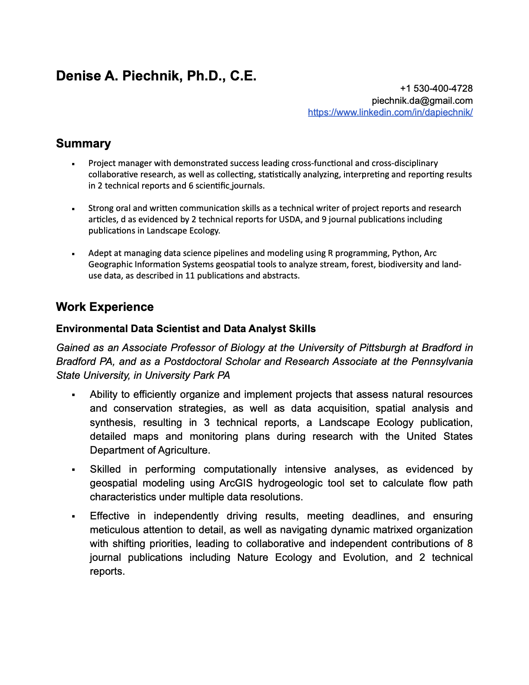
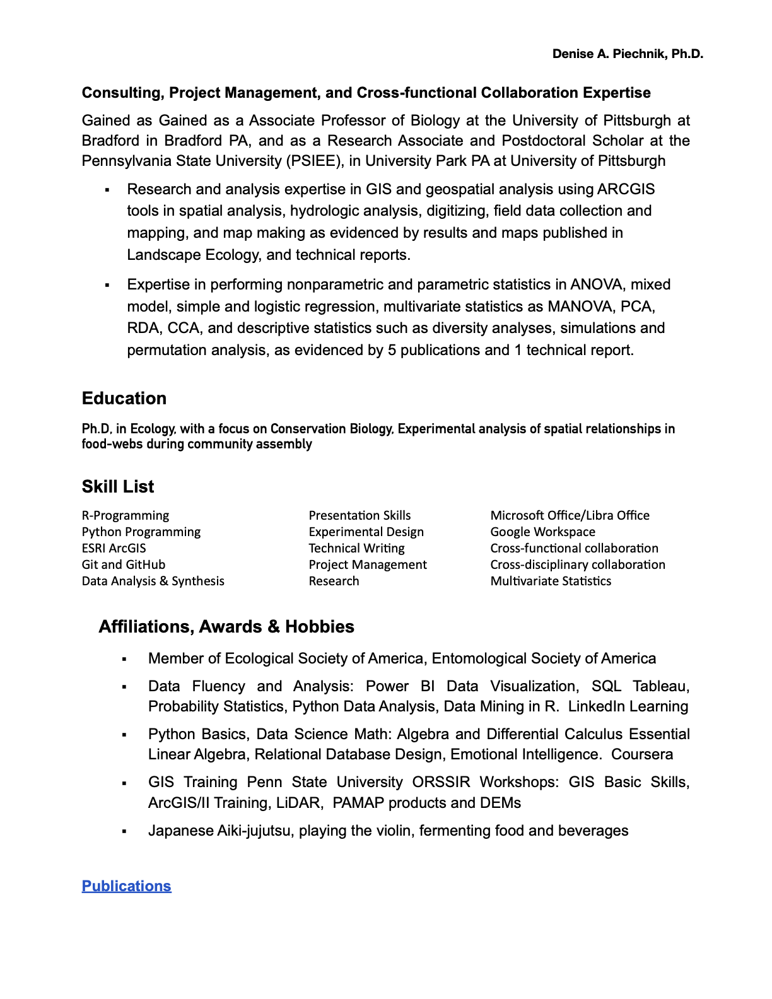

<a href="https://github.com/piechnik-d/dp/blob/a46eeb4eaf0485e1d860c010232508080df546e0/docs/DAPIECHNIK_RESUME_20240411.pdf" target="_blank" style="color:blue; font-size: 20px;">PDF of Resume</a>

<a href="https://scholar.google.com/citations?user=hTxoZYwAAAAJ&hl=en" target="_blank" style="color:blue; font-size: 20px;"> Publications </a>


```{r setup, include=FALSE}
knitr::opts_chunk$set(echo = FALSE)
```

```{r, echo=FALSE}

```

```{r, echo=FALSE}

```


<a href="https://scholar.google.com/citations?user=hTxoZYwAAAAJ&hl=en" target="_blank" style="color:blue; font-size: 20px;"> My Google Scholar Profile</a>
